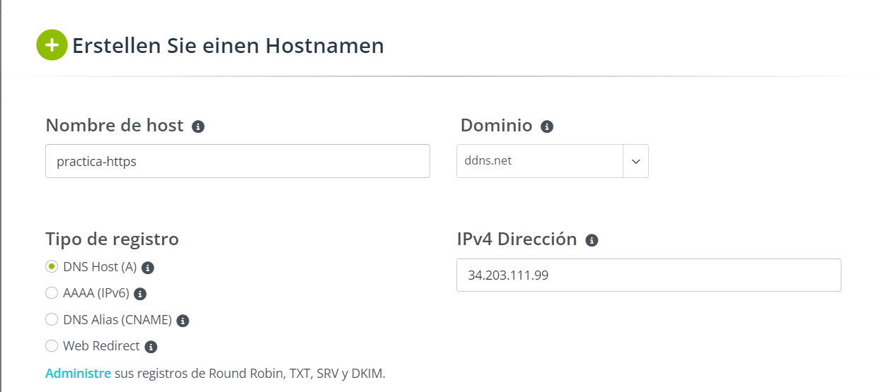

# Practica01-5IAW
Este repositorio es para la Práctica 1 apartado 5 de IAW

## Primer paso, scripts.
- Como primer paso tendremos que crear una carpeta llamada *_scripts_* como hemos hecho anteriormente. Añadiremos el *_script_* que tenemos creado de otras prácticas llamado `install_lamp.sh`.

- Podemos copiarlo y pegarlo, pero es bastante importante borrar las lineas que tenemos con el comando `cp` de otras prácticas anteriores, así que lo borramos y será totalmente funcional.

## Segundo paso, asignamos IP.

- Asignamos de manera manual una *_ip flotante_* a nuestra máquina para poder conectarnos por *_HTTP_*.

- Creamos también el archivo *_.env_* que hemos creado en otras prácticas pero ahora mismo se mantendrá vacio.

## Tercer paso, configuración del dominio.

- Registramos un nombre de dominio haciendo uso de algunas herramientas gratuitas que nos indica el profesor. Como por ejemplo: [No-IP](https://www.noip.com/es-MX).

- Para poder realizar esta acción tendremos que poner la ip flotante de nuestra máquina de aws para poder conectarla.

- En la siguiente captura podemos observar como quedaría:

    


- Podemos comprobar que se ha creado correctamente por que nos saldrá la siguiente pantalla:

    


## Cuarto paso, instalamos cerbot.

- ¿Que es Cerbot? Es un cliente que se utiliza para solicitar un certificado de Let´s Encrypt e implementarlo en un servidor web.

- Para poder instalar esta herramienta, en nuestro *_script_* tendremos que añadir lo siguiente:

```
#Instalamos y Actualizamos snapd.

snap install core
snap refresh core

# Eliminamos cualquier instalación previa de certobot con apt.

apt remove certbot

# Instalamos el cliente de Certbot con snapd.

snap install --classic certbot 

```

- Snap es un formato de distribución que es un paquete instalable universal.

## Quinto paso, obtenemos el certificado y configuramos el servidor Web de Apache.

- Haciendo uso del comando `sudo cerbot --apache` conseguiremos que se ejecute cerbot con apache, pero tendremos una serie de preguntas que iran surgiendo durante la instalación. De manera, que si queremos que esta instalación se haga de manera automatica, tendremos que configurar nuestro archivo `.env` con el nombre de las variables y el nombre que hemos elegido anteriormente para el dominio.

- El cual en mi caso es *practica-https.ddns.net*

- Aquí podemos observar como tengo creado mi archivo .env:

    

### Lanzamos el comando completo incluyendo las variables que hemos creado.

- Al añadir en el *_.env_* las variables con el nombre del dominio, podemos hacer que se ejecute de manera automatica sin hacer falta detener el comando para introducir cualquier dato por teclado. El resultado del teclado seria el siguiente:

- `certbot --apache -m $CERTIFICATE_EMAIL --agree-tos --no-eff-email -d $CERTIFICATE_DOMAIN --non-interactive`

- Para entender los parámetros que tenemos en el comando podemos hacer uso de la página de [Jose Juan](https://josejuansanchez.org/iaw/practica-https/index.html). De todos modos los parámetros que hemos utilizado aquí son los siguientes:

    ```Dirección de correo: -m demo@demo.es
    Aceptamos los términos de uso: --agree-tos
    No queremos compartir nuestro email con la Electronic Frontier Foundation: --no-eff-email
    Dominio: -d practicahttps.ml
    ```

## Ultimo apartado/paso.

- Podemos configurar en el script que ejecute un comando el cual es `systemctl list-timers` de manera que ejecture un temporizador que se encarge de renovar los certificados de manera automática.

- En mi script podemos verlo de la siguiente manera:

    ```
    #Con el siguiente comando podemos comprobar que hay un temporizador en el sistema encargado de realizar la renovación de los certificados de manera automática.

    systemctl list-timers 
    ```

- Si todo ha funcionado de manera correcta, podemos ver que nos salta este mensaje en consola indicando que la instalación ha sido realizada con exito.

    

- Después, podemos observar el funcionamiento del comando *_list_timers_*

    

- Y ya podremos acceder a nuestra IP pero utilizando solamente el nombre del dominio:

    